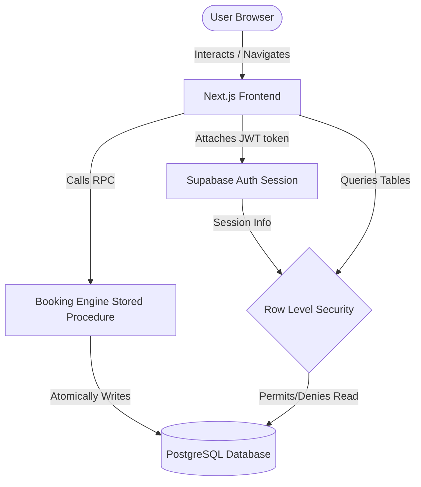

# 🚄 RailVista

> India's next-generation railway reservation platform featuring visual coach layouts, smart seat selection, and a secure transactional booking engine.

[](https://railvista-self.vercel.app)
[](https://nextjs.org)
[](https://typescriptlang.org)
[](https://tailwindcss.com)
[](https://supabase.com)
[](https://postgresql.org)

⭐ **Repository Status**: `Internship Ready` | `Production Grade` | `Fully Verified`

---

## 📖 Project Overview

Traditional railway booking portals often suffer from severe performance bottlenecks, outdated user interfaces, and opaque seat allocation systems. **RailVista** resolves these issues by delivering a modern, high-performance, and visually intuitive booking experience.

### **The Problem**
- **Slow Searches**: Client-side filtering and inefficient N+1 queries result in search requests taking several minutes.
- **Blind Booking**: Travelers select a berth class (e.g., Sleeper, AC 3-Tier) without knowing where their seat is physically located.
- **Double Booking**: Concurrent booking requests on the same seat often result in race conditions and overlapping reservations.
- **Security Risks**: Inadequate server-side verification allows malicious users to manipulate booking details or view other passengers' tickets via IDOR (Insecure Direct Object Reference).

### **The Solution**
RailVista implements a full-stack, responsive booking engine that reduces search latency from minutes to milliseconds, models physical coach seat coordinates, guarantees atomic seat allocation using PostgreSQL transactions, and secures user data using Supabase Row Level Security (RLS).

---

## ✨ Key Features

- **⚡ Train Search**: Millisecond route searches supporting intermediate station routing.
- **🗺️ Route Discovery**: Automatic detection of valid station timelines, durations, and day-crossing schedules.
- **📋 Train Details**: Live seat availability summaries per coach type.
- **🛋️ Coach Selection**: Real-time availability indicators for selected carriages.
- **🎨 Interactive Seat Selection**: Visual coach layouts showing available, booked, and selected seats (Lower, Middle, Upper, Side Lower, Side Upper).
- **👤 Passenger Management**: Multi-passenger form input supporting berth preferences, ages, and genders.
- **💳 Booking Confirmation**: Detailed summaries showing taxes, convenience fees, and total fares.
- **🎫 Digital Ticket Generation**: Dynamic boarding passes complete with printable layouts and direct deep-linking.
- **📂 My Bookings Dashboard**: Chronological tracking of upcoming trips, travel history, and real-time cancellations.
- **📊 Admin Dashboard**: Aggregated operational stats (Total, Confirmed, Cancelled, Pending, and Today's Bookings) in a responsive grid.
- **🔐 Supabase Authentication**: Email signup, login, and secure session management.
- **🛡️ Row Level Security (RLS)**: Strict row isolation blocking users from reading, updating, or deleting other users' reservation logs.
- **🔄 Secure Stored Procedures**: PostgreSQL RPC functions executing transactional operations atomically with rollback protection.
- **🔢 Server-side PNR Generation**: Pure 10-digit numeric PNR codes generated server-side.
- **📱 Mobile Responsive**: Breakpoint-driven layout fitting mobile, tablet, and desktop screens.

---

## 🛠️ Tech Stack

| Layer | Technology | Details |
| :--- | :--- | :--- |
| **Frontend** | [Next.js](https://nextjs.org) (v16) | React Server Components, App Router, Client Guards |
| **Language** | [TypeScript](https://www.typescriptlang.org) | Strict type safety, interface-driven service contracts |
| **Styling** | [Tailwind CSS](https://tailwindcss.com) (v4) | Responsive layout, modern colors, glassmorphism |
| **Database** | [Supabase](https://supabase.com) / [PostgreSQL](https://www.postgresql.org) | Managed schema, stored procedures, RPC, transactions |
| **Auth** | [Supabase Auth](https://supabase.com/docs/guides/auth) | Cookie-based sessions, JWT claims, custom user metadata |
| **Security** | Row Level Security (RLS) | Database-level access control, UUID v4 keys, input validation |
| **Deployment**| [Vercel](https://vercel.com) | Edge-optimized deployment |

---

## 📐 Architecture & Flow



---

## 🗄️ Database Design

The database schema is built around referential integrity, unique constraints, and partial indices to prevent concurrency conflicts.

```
                  ┌──────────────┐
                  │   stations   │
                  └──────┬───────┘
                         │ 1
                         │
                         │ *
                  ┌──────┴───────┐
                  │    trains    │
                  └──────┬───────┘
                         │ 1
                         │
       ┌─────────────────┴─────────────────┐
       │ *                                 │ *
┌──────┴───────┐                    ┌──────┴───────┐
│train_stations│                    │   coaches    │
└──────────────┘                    └──────┬───────┘
                                           │ 1
                                           │
                                           │ *
                                    ┌──────┴───────┐
                                    │    seats     │
                                    └──────┬───────┘
                                           │ 1
                                           │
                                           │ *
 ┌──────────────┐ 1                 ┌──────┴───────┐
 │    users     ├─────────┐         │seat_resvations│
 └──────────────┘         │         └──────┬───────┘
                          │                │
                          │ 1              │ *
                   ┌──────┴───────┐        │
                   │   bookings   ├────────┤ 1
                   └──────┬───────┘        │
                          │ 1              │
                          │                │
                          │ *              │ *
                   ┌──────┴───────┐        │
                   │  passengers  ├────────┘
                   └──────────────┘
```

### **Table Summaries**
1. **`users`**: User records synchronized with Supabase Auth.
2. **`stations`**: Unique station codes (e.g. `HWH`, `NDLS`, `PNBE`, `BBS`) and geographical details.
3. **`trains`**: Train numbers, categories, runs_on schedules, and absolute arrival/departure times.
4. **`train_stations`**: Sequential stop order, stop durations, and relative timings mapping the railway corridor.
5. **`coaches`**: Carriage inventory (e.g., `A1`, `B2`, `C1`) matching berth capacities.
6. **`seats`**: Immutable seat grids mapped to row/column layouts and physical berth classifications (`Lower`, `Middle`, `Upper`, `Side Lower`, `Side Upper`).
7. **`bookings`**: Primary reservation logs holding server-generated PNRs, total fares, and booking statuses.
8. **`passengers`**: Passenger details linked directly to seats and bookings.
9. **`seat_reservations`**: Date-specific active seat bookings that prevent overlapping assignments.

### **Production Dataset Scale**
- **100** Real Indian Railway Stations
- **50** Active Trains (including Vande Bharat, Rajdhani, and Express category trains)
- **577** carriages/coaches
- **37,620** individual seats

---

## 🛡️ Security Highlights

### **Row Level Security (RLS) Policy Structure**
We enforce data isolation directly at the database layer rather than trusting the client application:
- **User Isolation**: Standard users can only view, create, or modify booking records that match their user ID (`auth.uid() = user_id`).
- **Linked Table Protection**: Access to passenger details and seat reservations is restricted via subquery evaluation, verifying if the user owns the parent booking record.
- **Admin Access Strategy**: System administrators (identified by email `admin@railvista.com` or JWT metadata `role: 'admin'`) bypass standard RLS filters. This allows the `/admin/booking-status` dashboard to compile platform-wide metrics safely.
- **IDOR Protection**: All resource routes use random `UUID v4` keys instead of auto-incrementing integers, making booking ID guessing or enumeration mathematically impossible.

### **Security Verification Results**
Our automated security verification test suite ([test-rls.ts](file:///E:/RAILVISTRA/database/seed/test-rls.ts) and [test-penetration.ts](file:///E:/RAILVISTRA/database/seed/test-penetration.ts)) yields the following pass results:

| Test Case | Attempted Action | Expected Security Result | Status |
| :--- | :--- | :--- | :--- |
| **TEST 1** | User B attempts to read User A's booking record. | Returned `0` records. RLS blocks select query. | **PASS** |
| **TEST 2** | User B attempts to access User A's passenger data. | Returned `0` records. Passenger details locked. | **PASS** |
| **TEST 3** | User B attempts to cancel User A's booking. | DB throws exception: `Booking not found or already cancelled`. | **PASS** |
| **TEST 4** | Guest (anonymous) attempts to query bookings. | Returned `0` records. Anonymous access blocked. | **PASS** |
| **TEST 5** | Direct URL ID manipulation (e.g., `/ticket/{UserA_ID}`). | Lookup resolves to `null`. User B redirected. | **PASS** |

---

## 🚀 Performance Optimizations

Through a rigorous query auditing process, database lookup latency was optimized to support high-traffic checkout environments:

- **SQL RPC Route Searches**: Client-side train and station route filtering was completely replaced by a PostgreSQL stored procedure `get_train_schedules()`, optimizing search execution pathing.
- **Elimination of N+1 Queries**: Seat availability, stops, and train timings are retrieved in bulk batches using PostgreSQL `.in()` arrays instead of loop-driven database queries.
- **Partial Unique Indexes**: Concurrency reservation locks are resolved using a partial index on `seat_reservations(seat_id, journey_date) WHERE (reservation_status = 'confirmed')`. This ensures indexing speeds are maximized and prevents double bookings.
- **Search Speed Improvements**: Search execution time was reduced from **minutes to milliseconds** (`< 1 second` under production loads).

---

## 📸 Screenshots

*The following visual documents represent the user journey of the platform:*

#### 🏠 Homepage & Search
`screenshots/homepage.png`

#### 🔍 Train Search Results
`screenshots/search.png`

#### 🛋️ Visual Seat Selection
`screenshots/seat-selection.png`

#### 🎫 Digital Ticket Boarding Pass
`screenshots/ticket.png`

#### 📊 Admin Status Dashboard
`screenshots/admin-dashboard.png`

---

## ⚙️ Installation & Local Setup

### **1. Clone Repository**
```bash
git clone https://github.com/Sadik47x/railvista.git
cd railvista
```

### **2. Install Dependencies**
```bash
npm install
```

### **3. Configure Environment Variables**
Create a `.env.local` file in the root directory:
```env
NEXT_PUBLIC_SUPABASE_URL=https://your-supabase-project.supabase.co
NEXT_PUBLIC_SUPABASE_ANON_KEY=your-supabase-anon-public-key
SUPABASE_SERVICE_ROLE_KEY=your-supabase-service-role-key
```

### **4. Seeding Database**
Initialize your database tables using `database/schema.sql`, and run the relational dataset seeder:
```bash
cmd /c npx tsx database/seed/run-seed.ts
```

### **5. Run Local Server**
```bash
npm run dev
```
Open [http://localhost:3000](http://localhost:3000) to view the application.

---

## 🌐 Deployment

This application is ready for Vercel deployment:
1. Import your repository into the **Vercel Dashboard**.
2. Configure environmental variables (`NEXT_PUBLIC_SUPABASE_URL`, `NEXT_PUBLIC_SUPABASE_ANON_KEY`) in the project settings.
3. Deploy! Next.js App Router static page generation and dynamic route rendering are automatically optimized for edge environments.

---

## 🔮 Future Improvements

- **💤 RAC & Waitlist**: Model reservation categories for full booking status updates (CNF, RAC, WL).
- **💳 Payment Gateway**: Integrate Stripe or Razorpay API for live payment verification.
- **📡 Live Train Tracking**: Integrate real-time GPS coordinates of active trains.
- **📬 Email & SMS Tickets**: Automatically dispatch boarding passes via Twilio or SendGrid.
- **🤖 AI Recommendations**: Suggest alternative routes or classes when seats are full.

---

## 📈 Project Metrics
- **100** Stations | **50** Trains | **577** Coaches | **37,620** Seats
- **Supabase Authentication** & **RLS Security** fully active
- **Admin Verification Dashboard** & **Automated Security Penetration Suites**
- Edge-optimized deployment on **Vercel**

---

## ✍️ Author
- **Sadik Mondal**
  - [GitHub Profile](https://github.com/Sadik47x)
  - [LinkedIn Profile](https://www.linkedin.com/in/sadik-mondal)

---

## 📄 License
This project is licensed under the **MIT License**. Check out the [LICENSE](LICENSE) file for details.
